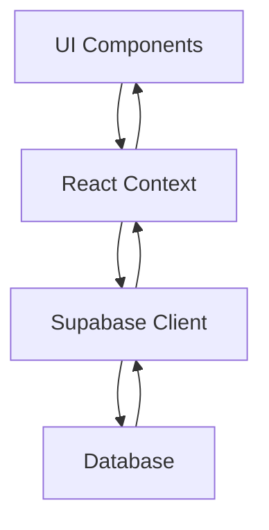

# ארכיטקטורת המערכת

## סקירה כללית

LoyalFlow בנויה כאפליקציית SPA (Single Page Application) המשתמשת ב-React בצד הלקוח ו-Supabase בצד השרת.

## שכבות המערכת

### 1. שכבת הממשק (UI)
- React + TypeScript
- Tailwind CSS לעיצוב
- Framer Motion לאנימציות
- GSAP לאפקטים מתקדמים

### 2. ניהול מצב (State Management)
- React Context לניהול מצב גלובלי
- Custom Hooks לניהול לוגיקה משותפת
- Zod לוולידציה

### 3. תקשורת עם השרת
- Supabase Client
- Real-time subscriptions
- REST API

### 4. אבטחה
- JWT לאימות
- Row Level Security (RLS)
- Policies מבוססות תפקידים

## תזרים נתונים

## ארכיטקטורת הקוד

### Components
- Atomic Design
- Composition over inheritance
- Custom Hooks לניהול לוגיקה

### Context
- AuthContext לניהול הרשאות
- BusinessContext לנתוני העסק
- AppointmentContext לניהול תורים

### Services
- API Wrappers
- Business Logic
- Validation