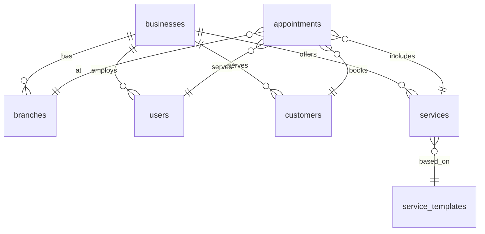

# מבנה בסיס הנתונים

## טבלאות

### businesses
- מידע על העסקים במערכת
- הגדרות ספציפיות לכל עסק
- קישור ייחודי להזמנת תורים

### users
- משתמשי המערכת (צוות ומנהלים)
- הרשאות וتפקידים
- שיוך לעסק

### branches
- סניפי העסק
- מיקום ופרטי קשר
- שעות פעילות

### customers
- לקוחות העסק
- היסטוריית תורים
- העדפות אישיות

### appointments
- תורים
- סטטוס ומעקב
- קישור ללקוח ולנותן השירות

### services
- שירותים מותאמים אישית לעסק
- מחירים ומשך זמן
- קטגוריות

### service_templates
- תבניות שירותים גלובליות
- שירותים נפוצים
- הגדרות ברירת מחדל

## יחסים



## אבטחה

### Row Level Security (RLS)
- הגבלת גישה לפי תפקיד
- מדיניות לכל טבלה
- בקרת הרשאות מדויקת

### Policies
```sql
-- דוגמה למדיניות גישה
CREATE POLICY "Users can view their own business data"
  ON businesses FOR SELECT
  USING (id IN (
    SELECT business_id 
    FROM users 
    WHERE auth.uid() = id
  ));
```